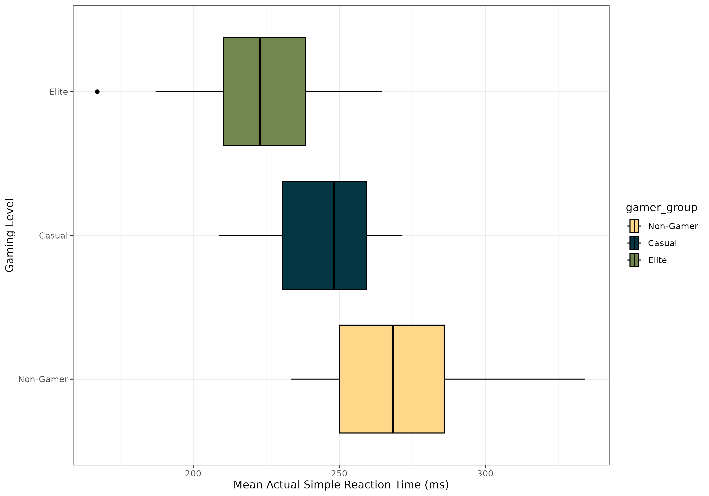
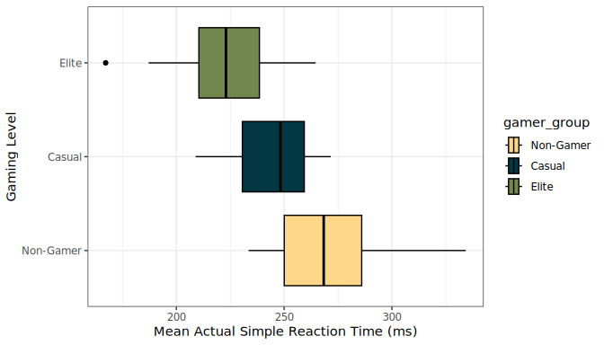
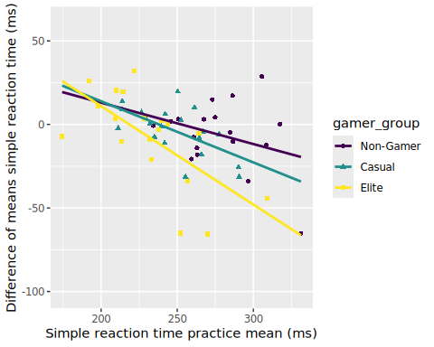
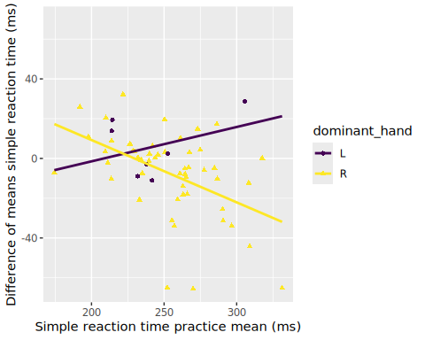
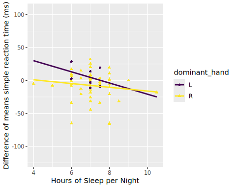
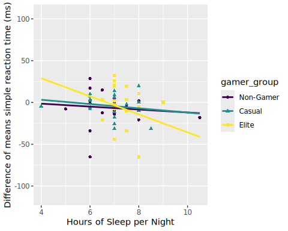
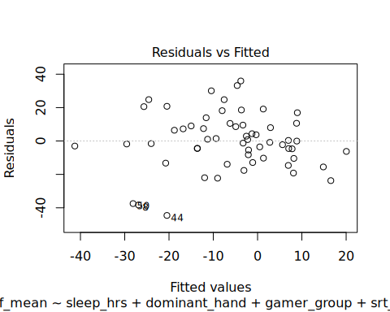
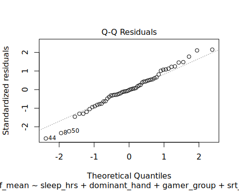
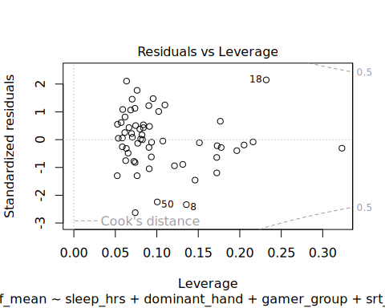

##### Cervantes, K^1^, Cornforth, C^2^ , & Gutierrez, D^3^

^*1*^*Department of Kinesiology, California State University Monterey Bay, Seaside, CA, USA*\
^*2*^*Department of Mathematics and Statistics, California State University Monterey Bay, Seaside, CA, USA* ^*3*^*Department of Applied Environmental Science, California State University Monterey Bay, Seaside, CA, USA*

# Abstract

This study uses multiple linear regression to analyze data of local Monterey and CSUMB Super Smash Bros Ultimate (SSBU) Esports tournaments from individuals who voluntarily participated in a Psytool kit test to assess simple reaction. Cognitive speed is essential for excelling in various online games and high-intensity competitions. Within the Esports industry, competitive SSBU players must respond within thousandths of a second to capitalize on game-specific stimuli. Furthermore, medical studies support an improvement in cognitive abilities within the elderly who participate in real-time strategy video games. This study aimed to determine if gaming level and additional health/lifestyle characteristics would result in improved cognitive speed. Contrary to what was expected, our model revealed that only individuals categorized as elite gamers showed any significance for predicting simple reaction speed.

# 1. Introduction

Many video games require quick reactions to play and win competitions, comparable to those in traditional sports (Bickman et al., 2021). Previous findings have found there to be a positive relationship between gaming habits and cognitive-motor ability. As such, regular gamers tend to outperform non-gamers when it comes to performing tasks in short-term memory and visual attentiveness (Boot et al., 2008). A recent study found evidence that asking participants about their gaming status positively affected performance for gamers and had an adverse effect on non-gamers in cognitive motor task performance (Ziv et. al., 2022). We hoped to apply these findings to the aging population and other groups that experience cognitive decline. Previous studies within the elderly population show that those who play real-time strategy video games saw an improvement in task switching, working memory, and visual short-term memory compared to those who did not (Basak et al., 2008). Understanding what factors may apply to improving cognitive performance is of great importance not only in the medical field but also in rehabilitation and development.

Esports, as a field, requires accuracy, where a thousandth of a second can determine whether a team or person wins. Skills such as quick reaction times increase the chances of success in faster-paced video games that require them (Ersin et al., 2022). Our model explored the relationship between simple reaction time and other predictive factors across different levels of competition. We expected to see our predictive variables of exercise hours a week, skill level, amount of sleep per night, age, and caffeine intake having an adverse relationship with reaction time. Other factors, such as dominant hand and sex, were investigated to see whether they had any predictive power. Evidence supports that faster reaction times have been found in right-hand-dominant people than left-hand-dominant people (Badau 2018).

# 2. Methods

## 2.1 Data Collection

Data was collected from areas including local Monterey and CSUMB Esports tournaments, large scale Super Smash Bros Ultimate (SSBU) tournaments, and the CSU Monterey Bay library. Subjects voluntarily participated in a Psytool kit test to assess simple reaction time. The Psytool kit assessments were computerized tests administered in person. Participants were first administered a practice assessment to get them accustomed to the software and test. Succeeding was the actual assessment, where results were printed to a CSV file with the averages and peaks. Additionally, participants completed a questionnaire on weekly hours of sleep, caffeine intake, and other items of interest.

## 2.2 Variable Creation

Listed below are the variables relevant to the study categorized by their general purpose of measurement.

Health and Lifestyle:

- Sex - Male or Female
- Age in years
- Dominant hand
- Caffeine Intake- Reported caffeine intake (mg) per day
- Hours of sleep - Typical hours of sleep per night
- Exercise hours per week

Level of Gaming/Type:

- Gaming (measured as Non-Gamer, Casual-SB, Elite-SB)
  - Abbreviations: SB (Super Smash Bros Ultimate player)
  - Non-Gamer; play SSBU \<4 hours per week and exercise \<4 hours per week
  - Casual; play \>4 hours per week
  - Elite; top 150 globally-ranked competitive SSBU players as determined by 2024 Lumirank rankings

Cognitive measure test:

- Mean simple reaction practice test performance in milliseconds (ms)

- Mean simple reaction practice test performance in milliseconds (ms)

- Difference of means simple reaction test performance in milliseconds (ms); (Actual mean - Practice mean)

## 2.3 Analytic Methods

Exploratory data analysis of the variables will be used to assess their potential significance for model creation. A boxplot will be used to illustrate differences in performance for the simple reaction test across the levels of gaming to assess any suggestive evidence for a difference that might indicate its importance for modelling the response. Other graphics and summary statistics to be included are a scatterplot, a QQ-plot, a residual plot, a Cook's distance plot, and a VIF output for assessing model conditions (see Appendix).

Multiple linear regression will be used for the analysis of this study within RStudio. Provided that the response was a numerical value (simple reaction time mean), and all other explanatory variables were a mix of categorical and nominal, this model design was best suited. An automated best subset selection using Adjusted R-squared will be used for finding the best model form. A nested F-test will be performed to assess whether the suggested "best model" is significantly different from the original full model in which case the study would base all conclusions and assumption checks based on the output of the "best model".

# 3. Results

## 3.1 Exploratory Data Analysis

Our sample consists of 58 participants between the ages of 18 to 55, each grouped into levels gaming status: non-gamer (n = 18), casual (n = 21), and elite (n = 19) (Table 1 Appendix). In the boxplots (Figure 1), it's shown that at least 75% of the mean actual simple reaction times (ms) of individuals categorized as Non-gamers ($Q_{1} = 250.05$) reside above at least 75% of the reaction times for elite level ($Q_{3} = 238.525$) and at least 50% of the data for casual gamers ($M = 248.30$). Differences between the reported mean practice and mean actual simple reaction times prompted the use of the difference of these values as the response variable for model creation.

{width="6.5in" height="4.55in"}

Figure 1. Distribution of mean actual reaction times (ms) among non-gamers, casual smash players, and competitive smash players

## 3.2 Automated Variable Selection

Results of the automated variable selection using best subsets with Adjusted $R^{2}$ found that the model should only include dominant hand, gaming level, simple reaction time practice mean (ms), and hours of sleep per night (hrs). The model produced an Adjusted $R^{2}$ = 0.2978, in comparison to the full model Adjusted $R^{2}$ = 0.2543 (see Variable Selection in Appendix). The nested F-test between the reduced ("best") model and full model, showed no significant difference (F = 0.242, p = 0.9131, df = 4, $\alpha$ = 0.05) prompting the use of the reduced model for determining conclusions (see Nested F-test in Appendix ). All model conditions aside from linearity for the explanatory variables gaming level and dominant hand were met (see Assumption Check in Appendix). Below is the final model equation:

$${\widehat{y}}_{srt\_ diff\_ mean} = 148.15475 - 3.56725x_{sleep\_ hours} - 11.23961x_{dominant\_ handR} - 11.19285x_{gamer\_ groupCasual} - 20.44156x_{gamer\_ groupElite} - 0.42982x_{srt\_ practice\_ mean}$$

## 3.3 Summary Results of Model

Overall the model was found to be a significant predictor (F(5, 52) = 5.834, p = 0.0002) of simple reaction time mean (ms), returning an Adjusted $R^{2}$ = 0.2978. The variables dominant hand, nightly hours of sleep, and the casual gamer group were each deemed to not be significant individual-level predictors of simple reaction time mean (all p-values \> 0.05). However, the elite gamer group (t = -2.822, p = 0.00674) and simple reaction time practice mean (ms) (t = -4.870, p = \<0.0001) were significant as shown below in Table 2.

###### Table 2: Output for Multiple Linear Regression Model

| Predictor         | Estimate  | SE       | t      | p-value  |
|:------------------|:----------|:---------|:-------|:---------|
| (Intercept)       | 148.15475 | 30.98086 | 4.782  | 1.47e-05 |
| sleep_hrs         | -3.56725  | 2.46911  | -1.445 | 0.15453  |
| dominant_handR    | -11.23961 | 7.20737  | -1.559 | 0.12495  |
| gamer_groupCasual | -11.19285 | 6.24879  | -1.791 | 0.07908  |
| gamer_groupElite  | -20.44156 | 7.24364  | -2.822 | 0.00674  |
| srt_practice_mean | -0.42982  | 0.08825  | -4.870 | 1.08e-05 |

It is shown that participants from the elite gamer group are expected to have a simple reaction time practice mean 20.44 ms faster on average when compared to non-gamers, given dominant hand, simple reaction time practice mean (ms), and hours of sleep per night remain fixed. Additionally, for every 1 ms increase in simple reaction time practice mean, participants are expected to have a mean simple reaction time 0.43 ms faster on average, given dominant hand, nightly hours of sleep, and gaming level remain fixed (Table 2).

# 4. Discussion / Conclusion

The purpose of this study is to determine whether an individual's amount of exercise per week, gaming level, hours of sleep per night a week, age, practice mean performance for the simple reaction time, and caffeine intake predict the performance for the difference of means in a simple reaction test. In addition, sex and an individual's dominant hand were considered in the model. Following automated best subset selection using Adjusted R\^2, the only variables to be included were dominant hand, hours of sleep per night a week, gaming level, and the practice mean performance for the simple reaction time. Results of the nested F-test with the full and reduced model displayed no significant difference (F = 0.242, p-value = 0.9131). The best-suited model concluded that there is very strong evidence that at least one variable in the model has predictive power for the performance for the difference of means in a simple reaction test (F = 5.834, p-value = 0.000238). However, the model overall is a poor fit given the relatively low adjusted R\^2 value (R\^2 = 0.2978).

Our analyses showed that elite players tended to have faster reaction times than their casual and non-gamer counterparts (t=-2.822, p-value=.00674), but all other variables were not indicative of predicting reaction time within our model (all p-values \> 0.05). This aligns with the current literature that pro-athletes tend to have faster reaction times than their non-athlete equivalent (Atan & Pelin, 2024). The results of variables such as age and hours of sleep (t=-1.445, p-value=0.15453) did not meet our hypotheses, as we expected to see a relationship in reaction time with older participants and in those who got less sleep. However, the variable age did not make it past variable selection; this may be due to age being an inclusion criterion in the study, and our sample comprising mostly college students. Being able to apply these results to people of older age was limited due to these factors. The dominant hand variable (t=-1.559, p=.12495), showing non-significance, may also be attributed to participants being used to using a controller with both hands, making the differences between the two hands negligible in comparison. These results may help us in bridging the connection between Esports athletes and traditional athletes and their physiological adaptations.

From our model, only 29.78% of the variability in simple reaction time can be explained by the linear model with the explanatory variables dominant hand, gaming level, simple reaction time practice mean (ms), and hours of sleep per night (hrs). This suggests that our variables are weak predictors of the response. More so, this indicates that more important factors exist for predicting simple reaction time.

Our initial exploratory data showed a constant failure in linearity between our variables. Possible plans would include the incorporation of interaction terms within the model. We were also limited by our sample size, both overall and within categories, creating a large amount of variance. Provided this was taken with a volunteer sample, our results are not generalizable to the larger population of Esports players, as well as limiting the clinical application of these results. Furthermore, the lack of randomization of the explanatory variables means no causal conclusions can be made between skill level and reaction time. Our results, that only the elite status is indicative of reaction time, should be further explored in studies looking into the relationship between Esports and cognitive performance, given these limitations.

# 5. References

Tülin, A., & Akyol, P. (2014) "Reaction Times of Different Branch Athletes and Correlation between Reaction Time Parameters." Procedia - Social and Behavioral Sciences, vol. 116, Feb. 2014, pp. 2886--89. DOI.org (Crossref), https://doi.org/10.1016/j.sbspro.2014.01.674

Badau, D., Baydil, B., & Badau, A. (2018). Differences among three measures of reaction time based on hand laterality in individual sports. Sports, 6(45).

Basak, C., Boot, W. R., Voss, M. W., & Kramer, A. F. (2008). "Can Training in a Real-Time Strategy Video Game Attenuate Cognitive Decline in Older Adults?" Psychology and Aging, vol. 23, no. 4, Dec. 2008, pp. 765--77. PubMed, https://doi.org/10.1037/a0013494

Bickman, P., Wechsler, K., Rudolf, K., Tholl, C., Frobose, I., & Grieben, C. (2021). Comparison of reaction time between eSports players of different genres and sportsmen. International Journal of eSports Research, 1(1).

Boot, WR., Kramer, AF., Simons, DJ., Fabiani, M., Gratton, G. (2021) "The Effects of Video Game Playing on Attention, Memory, and Executive Control." Acta Psychologica, vol. 129, no. 3, Nov. 2008, pp. 387--98. ScienceDirect, https://doi.org/10.1016/j.actpsy.2008.09.005

Dell'Osso, L., Nardi, B., Massoni, L., Battaglini, S., De Felice, C., Bonelli, C., Pini, S., Cremone, I. M., & Carpita, B. (2024). "Video Gaming in Older People: What Are the Implications for Cognitive Functions?" Brain Sciences, vol. 14, no. 7, July 2024, p. 731. PubMed Central, https://doi.org/10.3390/brainsci14070731

Ersin, A., Tezeren, H., Pekyavas, N., Asal, B., Atabey, A., Diri, A., & Gonen, I. (2022). The relationship between reaction time and gaming time in E-sports players. Kinesiology, 54(1), 36-42.

Google. (2026). Gemini \[Large language model\]. google.com.

Ziv, G., Lidor, R. & Levin, O. Reaction time and working memory in gamers and non-gamers. Sci Rep 12, 6798 (2022). https://doi.org/10.1038/s41598-022-10986-3

# 6. Statement on the Use of AI

```         
We used generative AI for troubleshooting code issues and discovering functions. An example of a prompt that we used was “How to turn a character variable into a factor variable in R” and similar prompts. Additional prompts included “why is the LOOCV returning NaN?” when we explored the idea of cross-validation. The AI source used was the generic google search AI overview (Gemini). All source searching, interpretations, and discussions were done by the authors of the paper.
```

# 7. Appendix of All R Code

## 7.1 Library Packages Used

```         
#mosaic package makes some functions more user-friendly for Intro Stat topics
library(mosaic)
#ggformula & ggplot2 packages are for graphics
library(ggformula)
library(ggplot2)
#janitor package will help us clean up variable names
library(janitor)
#dplyr, tidyverse, and forcats packages will help with data cleaning (managing tidy data)
library(dplyr)
library(tidyverse)
library(forcats)
#for nicely formatted tables of parameter estimates and related statistics.
library(gtsummary)
# color package
library(paletteer)
# for nicely formatted tables of parameter estimates and related statistics
library(gt)
# For automated variable selection
library(leaps)
# for Nested F-test
library(car)
```

## 7.2 Reading In Data & Data Cleaning/Variable Creation

```         
#Read and cleaning data: Ensuring numerical values are treated as such.
esports_raw <- read_csv("esports_joined_fixed.csv",
                        col_types = list('simple_reaction_time_mean_rt' = col_double(),
                                         'simple_reaction_time_actual_mean_rt_ms' = col_double(),
                                         'simple_reaction_time_practice_mean_rt_ms' = col_double(),
                                         'non_gamers_exercise_hours_week' = col_double(),
                                         'non_gamers_gaming_hr_week' = col_double(),
                                         'non_gamers_caffeine_intake_mg_d' = col_double(),
                                         'non_gamers_age_y' = col_double(),
                                         'non_gamers_sleep_hours_night' = col_double()))

# Cleaning data: Reassigning the values for gamer level and re-leveling the categories
non_cas_elite <- esports_raw|>
  filter(str_detect(participant_code, "NG") |
           str_detect(participant_code, "CAS") |
           str_detect(participant_code, "ES"))|>
  mutate(gamer_group = case_when(
    str_starts(participant_code, "NG") ~ "Non-Gamer",
    str_starts(participant_code, "CAS") ~ "Casual",
    str_starts(participant_code, "ES") ~ "Elite"
  ))|> 
  mutate(gamer_group = factor(gamer_group, 
                          levels = c("Non-Gamer", "Casual", "Elite")))|>
  rename(srt_actual_mean = simple_reaction_time_actual_mean_rt_ms,
         srt_diff_mean = simple_reaction_time_mean_rt,
         srt_practice_mean = simple_reaction_time_practice_mean_rt_ms,
         exercise_hrs = non_gamers_exercise_hours_week,
         gaming_hrs = non_gamers_gaming_hr_week,
         caffeine_intake = non_gamers_caffeine_intake_mg_d,
         sleep_hrs = non_gamers_sleep_hours_night,
         age = non_gamers_age_y)

# Cleaning data: Removing NA's and ensuring sex and dominant hand are treated as factors
non_cas_elite_2 <- non_cas_elite|>
  select(m_f, age, dominant_hand, caffeine_intake, sleep_hrs, exercise_hrs, gamer_group, srt_diff_mean, srt_practice_mean)|>
  mutate(
    m_f = factor(m_f),
    dominant_hand = factor(dominant_hand))|>
  drop_na()
```

## 7.3 Exploratory Data Analysis

```         
#Boxplot of the actual mean simple reaction time for each level of gaming
p1 <- non_cas_elite|>
  drop_na(srt_diff_mean)|>
  ggplot() +
  scale_fill_paletteer_d("nationalparkcolors::Acadia") +
  geom_boxplot(aes(x = srt_actual_mean,
                   y = gamer_group,
                   fill = gamer_group),
               color = "black") +
  labs(x = "Mean Actual Simple Reaction Time (ms)",
       y = "Gaming Level",
       color = "Gamer Group") +
  theme(legend.position = "none") +
  theme_bw()
  
p1
```

{width="6.5in" height="3.714284776902887in"}

```         
#ggsave("srt_gamer_level.png", plot = p1, width = 10, height = 7)

level_table <- non_cas_elite|>
  drop_na(srt_diff_mean)|>
df_stats(srt_actual_mean ~ gamer_group)

level_table
         response gamer_group    min     Q1 median      Q3   max     mean
1 srt_actual_mean   Non-Gamer 233.50 250.05 268.35 285.975 334.2 271.9417
2 srt_actual_mean      Casual 208.95 230.60 248.30 259.350 271.6 244.8976
3 srt_actual_mean       Elite 167.20 210.45 223.00 238.525 264.6 223.9316
        sd  n missing
1 27.84887 18       0
2 18.47549 21       0
3 24.46363 19       0
```

## 7.4 Full Model Creation & Output

```         
#Creation of the full model
full_model <- lm(srt_diff_mean ~ m_f + age + dominant_hand + caffeine_intake + sleep_hrs + exercise_hrs + gamer_group + srt_practice_mean, data = non_cas_elite_2)


#Output of the full model
summary(full_model)

Call:
lm(formula = srt_diff_mean ~ m_f + age + dominant_hand + caffeine_intake + 
    sleep_hrs + exercise_hrs + gamer_group + srt_practice_mean, 
    data = non_cas_elite_2)

Residuals:
    Min      1Q  Median      3Q     Max 
-44.008 -10.292  -0.581  10.341  35.951 

Coefficients:
                   Estimate Std. Error t value Pr(>|t|)    
(Intercept)       164.21728   39.17597   4.192 0.000118 ***
m_fM                2.60123   12.09147   0.215 0.830578    
age                -0.52770    0.64997  -0.812 0.420872    
dominant_handR    -12.05222    7.54131  -1.598 0.116570    
caffeine_intake     0.01118    0.02527   0.442 0.660280    
sleep_hrs          -3.99565    2.65805  -1.503 0.139332    
exercise_hrs        0.47300    0.95057   0.498 0.621041    
gamer_groupCasual -14.75261   12.78218  -1.154 0.254151    
gamer_groupElite  -24.52584   13.74664  -1.784 0.080724 .  
srt_practice_mean  -0.43544    0.09643  -4.515 4.11e-05 ***
---
Signif. codes:  0 '***' 0.001 '**' 0.01 '*' 0.05 '.' 0.1 ' ' 1

Residual standard error: 18.17 on 48 degrees of freedom
Multiple R-squared:  0.372, Adjusted R-squared:  0.2543 
F-statistic:  3.16 on 9 and 48 DF,  p-value: 0.004512
```

## 7.5 Variable Selection

```         
#Automated variable selection using Adj. R^2 to find best model

models_r2 <- regsubsets(srt_diff_mean ~ m_f + dominant_hand + gamer_group + age + caffeine_intake + sleep_hrs + exercise_hrs + srt_practice_mean,
        data = non_cas_elite_2,
        method = "exhaustive")

summary_r2 <- summary(models_r2)

results <- data.frame(summary_r2$which, adjr2 = summary_r2$adjr2)

# Rank models by Adj. R^2
ranked_models <- results[order(results$adjr2, decreasing = TRUE), ]
head(ranked_models)
  X.Intercept.  m_fM dominant_handR gamer_groupCasual gamer_groupElite   age
5         TRUE FALSE           TRUE              TRUE             TRUE FALSE
6         TRUE FALSE           TRUE              TRUE             TRUE  TRUE
4         TRUE FALSE           TRUE              TRUE             TRUE FALSE
7         TRUE FALSE           TRUE              TRUE             TRUE  TRUE
8         TRUE FALSE           TRUE              TRUE             TRUE  TRUE
3         TRUE FALSE          FALSE              TRUE             TRUE FALSE
  caffeine_intake sleep_hrs exercise_hrs srt_practice_mean     adjr2
5           FALSE      TRUE        FALSE              TRUE 0.2977784
6           FALSE      TRUE        FALSE              TRUE 0.2885986
4           FALSE     FALSE        FALSE              TRUE 0.2833721
7           FALSE      TRUE         TRUE              TRUE 0.2808203
8            TRUE      TRUE         TRUE              TRUE 0.2688147
3           FALSE     FALSE        FALSE              TRUE 0.2594330
```

## 7.6 Best Model Creation, Nested F-test & Model Output

```         
# Creation of reduced (best) model based on output of variable selection
best_model <- lm(srt_diff_mean ~ sleep_hrs + dominant_hand + gamer_group + srt_practice_mean, data = non_cas_elite_2)

# Nested F-test testing whether the two models are significantly different
anova(best_model, full_model)
Analysis of Variance Table

Model 1: srt_diff_mean ~ sleep_hrs + dominant_hand + gamer_group + srt_practice_mean
Model 2: srt_diff_mean ~ m_f + age + dominant_hand + caffeine_intake + 
    sleep_hrs + exercise_hrs + gamer_group + srt_practice_mean
  Res.Df   RSS Df Sum of Sq     F Pr(>F)
1     52 16165                          
2     48 15846  4    319.61 0.242 0.9131
# Output of the reduced (best) model - Manually input these values for Table 2
summary(best_model)

Call:
lm(formula = srt_diff_mean ~ sleep_hrs + dominant_hand + gamer_group + 
    srt_practice_mean, data = non_cas_elite_2)

Residuals:
    Min      1Q  Median      3Q     Max 
-44.584  -9.772  -0.438   9.381  35.939 

Coefficients:
                   Estimate Std. Error t value Pr(>|t|)    
(Intercept)       148.15475   30.98086   4.782 1.47e-05 ***
sleep_hrs          -3.56725    2.46911  -1.445  0.15453    
dominant_handR    -11.23961    7.20737  -1.559  0.12495    
gamer_groupCasual -11.19285    6.24879  -1.791  0.07908 .  
gamer_groupElite  -20.44156    7.24364  -2.822  0.00674 ** 
srt_practice_mean  -0.42982    0.08825  -4.870 1.08e-05 ***
---
Signif. codes:  0 '***' 0.001 '**' 0.01 '*' 0.05 '.' 0.1 ' ' 1

Residual standard error: 17.63 on 52 degrees of freedom
Multiple R-squared:  0.3594,    Adjusted R-squared:  0.2978 
F-statistic: 5.834 on 5 and 52 DF,  p-value: 0.000238
```

## 7.7 Assumptions/Condition Checks for Best Model

```         
#Linearity check
non_cas_elite_2|>
gf_point(srt_diff_mean ~ srt_practice_mean,
        shape = ~gamer_group, color = ~gamer_group,
         xlab = "Simple reaction time practice mean (ms)",
         ylab = "Difference of means simple reaction time (ms)") |>
  gf_lm() +
  scale_color_viridis_d()
```

{width="5.0526312335958in" height="4.0421052055993in"}

```         
non_cas_elite_2|>
gf_point(srt_diff_mean ~ srt_practice_mean,
        shape = ~dominant_hand, color = ~dominant_hand,
         xlab = "Simple reaction time practice mean (ms)",
         ylab = "Difference of means simple reaction time (ms)") |>
  gf_lm() +
  scale_color_viridis_d()
```

{width="5.0526312335958in" height="4.0421052055993in"}

```         
non_cas_elite_2|>
gf_point(srt_diff_mean ~ sleep_hrs,
        shape = ~dominant_hand, color = ~dominant_hand,
         xlab = "Hours of Sleep per Night",
         ylab = "Difference of means simple reaction time (ms)") |>
  gf_lm() +
  scale_color_viridis_d()
```

{width="5.0526312335958in" height="4.0421052055993in"}

```         
non_cas_elite_2|>
gf_point(srt_diff_mean ~ sleep_hrs,
        shape = ~gamer_group, color = ~gamer_group,
         xlab = "Hours of Sleep per Night",
         ylab = "Difference of means simple reaction time (ms)") |>
  gf_lm() +
  scale_color_viridis_d()
```

{width="5.0526312335958in" height="4.0421052055993in"}

```         
# Collinearity assumption check
vif(best_model)
                      GVIF Df GVIF^(1/(2*Df))
sleep_hrs         1.093217  1        1.045570
dominant_hand     1.028512  1        1.014156
gamer_group       1.608675  2        1.126204
srt_practice_mean 1.519908  1        1.232846
# Independence & equal variance of residuals check
plot(best_model, 1, add.smooth = FALSE)
```

{width="5.0526312335958in" height="4.0421052055993in"}

```         
# Normality of residuals check
plot(best_model, 2)
```

{width="5.0526312335958in" height="4.0421052055993in"}

```         
# No influential points check
plot(best_model, 5, add.smooth = FALSE)
```

{width="5.0526312335958in" height="4.0421052055993in"}

```         
# The residuals for the fitted values of mean simple reaction time (ms) for our model with dominant hand, mean practice simple reaction time (ms), gaming level, and hours of sleep per week (hrs) closely follows the 1:1 line, with 3 moderate deviations below the line near the lower tail, leaving no indication of systematic deviation. Given n = 58, the very slight deviation observed from the 1:1 line is acceptable. Thus, the residuals have a cumulative frequency rate that increases at the same rate of the normal curve meeting normality. The spread of the residuals about zero appears to be relatively the same across all fitted values of mean simple reaction time (ms) supporting equal variance. The distribution of the residuals about zero appears to be random across all fitted values of mean simple reaction time (ms) supporting independence. Given there are no points past Cook’s Distance of either 0.5 or 1, there are no outliers or influential points suggesting a disproportionate impact on the regression estimates. Based on the output of the VIF scores using the GVIF (adjusted) there is no presence of collinearity (VIF<10). However, the intersection of our slopes within the scatterplots suggests that linearity is not met. Thus all conditions aside from linearity are met.
```
